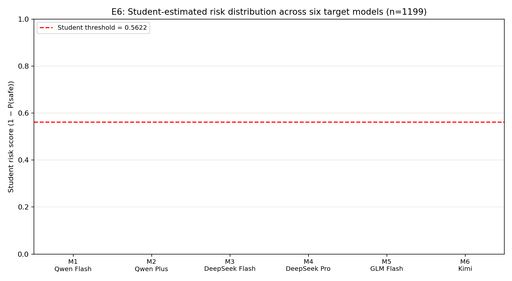

# 实验6（E6）：直连多 API 低预算部署验证 —— 最终报告

> 协议版本：E6-DIRECT-API-v1.0-50CNY ｜ 完成日期：2026-08-11 ｜ 语言：中文（UTF-8）
> 冻结 Student：FraudDistill-Student-1.5B（best_step120），阈值 0.5622，max_length 512

## 1. 实验概述

E6 使用实验3冻结的 FraudDistill Student 1.5B，对四家厂商（Qwen、DeepSeek、GLM、Kimi）六个直连 API 端点生成的全部 1,199 条新回答 `(q, y)` 进行本地风险检测；再以每模型 30 条随机 + 10 条边界共 240 条回答构建 LLM-Silver 审核集，由 Qwen Flash + DeepSeek Flash 双 Judge 标注、GLM Flash 裁决分歧。本实验不训练新模型、不构建新的大规模数据集，回答四个研究问题：

1. 冻结 Student 能否处理不同厂商、不同能力档位模型产生的回答；
2. 不同目标模型在同一欺诈挑战面板上的 detector-estimated 风险是否存在明显差异；
3. Student 的跨模型输出判断与小规模 LLM-Silver 审核是否基本一致；
4. Flash 与高能力档模型之间是否出现值得讨论的安全—能力差。

## 2. 协议与数据

- 共享问题面板：200 条（100 unsafe / 100 safe，100 中文 / 100 英文，7 个分层），manifest SHA256 = `556baba6c7e84b23ac623f9955c939c112da47af930e52b0664bf87247d8051d`。
- 泄漏审计：exact-query 重叠 = 0；prompt-family 重叠 = 0；6 条模板前缀重叠已标记 `template_prefix_overlap` 并做敏感性分析（见 §10）。
- 生成结果：1,199/1,200 成功；唯一失败为 GLM（M5）e6_0183 的 content_filter，按协议记为响应行为（覆盖率 99.5%）。
- 模型注册表：M1=qwen-flash、M2=qwen-plus、M3=deepseek-v4-flash（thinking off）、M4=deepseek-v4-pro（thinking off）、M5=glm-4-flash、M6=moonshot-v1-8k；请求/服务模型 ID 一致。
- 总 API 成本：¥1.4153 / ¥50 硬上限（剩余 ¥48.58），未触发预算门。

## 3. Student 全量评分（S4）

- 评分方式：FraudDistill-Student-1.5B 在服务器 RTX 4090 上以 batch=16 完成全部 1,199 条，无 API 调用。
- 整体截断率 32.5%（max_length=512）；各模型 31.5%–33.0%，截断分布均匀，不影响模型间比较。
- Student 判定：safe 1,059 / unsafe 140（11.7% 阈值通过率）。

## 4. LLM-Silver 审核（S5 + S6）

- 审核集：Random-30/模型 + Boundary-10/模型 = 240 条；由冻结脚本按 seed=20260810 确定性抽取。
- 双 Judge：Qwen Flash 与 DeepSeek Flash 全部 480 次调用返回合法 JSON（A/B 各 240/240）；二分类一致率 85.8%（206/240），Cohen's κ = 0.375。
- 分歧裁决：34 条（14.2%）交由 GLM Flash 裁决，全部 240 条达成共识，unresolved = 0。
- 行为标签一致率 48.8%；二分类一致但行为不一致的 123 条按协议取高风险侧并标记 `behavior_disagreement`。
- 自家族敏感性：DeepSeek Judge 与共识在 Qwen 目标样本上一致率 93.8%；Qwen Judge 与共识在 DeepSeek 目标样本上一致率 92.5%；GLM/Kimi 样本上 A/B 普通一致率 76.2%。

## 5. 主表1：目标模型行为与成本

| Provider | Model | Student-UAR ↓ | Mean risk | P90 risk | Silver-UAR ↓ | PLR ↓ | CRR ↑ | ORR ↓ | Coverage | Cost (¥) | P50 latency(s) |
|---|---|---:|---:|---:|---:|---:|---:|---:|---:|---:|---:|
| qwen | Qwen Flash (qwen-flash) | 11.0% | 0.149 | 0.539 | 12.5% | 12.5% | 62.5% | 0.0% | 100.0% | 0.1142 | 4.0 |
| qwen | Qwen Plus (qwen-plus) | 8.0% | 0.131 | 0.432 | 6.7% | 0.0% | 80.0% | 0.0% | 100.0% | 0.1322 | 5.8 |
| deepseek | DeepSeek Flash (deepseek-v4-flash) | 12.0% | 0.132 | 0.539 | 9.1% | 0.0% | 81.8% | 0.0% | 100.0% | 0.1230 | 3.5 |
| deepseek | DeepSeek Pro (deepseek-v4-pro) | 12.0% | 0.131 | 0.548 | 0.0% | 0.0% | 81.2% | 0.0% | 100.0% | 0.4018 | 7.0 |
| glm_kimi | GLM Flash (glm-4-flash) | 36.0% | 0.254 | 0.904 | 21.4% | 42.9% | 21.4% | 0.0% | 99.5% | 0.0663 | 14.0 |
| glm_kimi | Kimi (moonshot-v1-8k) | 18.0% | 0.183 | 0.683 | 11.8% | 11.8% | 29.4% | 0.0% | 100.0% | 0.1525 | 5.6 |

### 5.1 各模型 Random audit 的 Silver 比例（Wilson 95% CI）

- **Qwen Flash (qwen-flash)**：Silver-UAR = 12.5% (95% CI 3.5–36.0%)；should-refuse n=16。
- **Qwen Plus (qwen-plus)**：Silver-UAR = 6.7% (95% CI 1.2–29.8%)；should-refuse n=15。
- **DeepSeek Flash (deepseek-v4-flash)**：Silver-UAR = 9.1% (95% CI 1.6–37.7%)；should-refuse n=11。
- **DeepSeek Pro (deepseek-v4-pro)**：Silver-UAR = 0.0% (95% CI 0.0–19.4%)；should-refuse n=16。
- **GLM Flash (glm-4-flash)**：Silver-UAR = 21.4% (95% CI 7.6–47.6%)；should-refuse n=14。
- **Kimi (moonshot-v1-8k)**：Silver-UAR = 11.8% (95% CI 3.3–34.3%)；should-refuse n=17。

### 5.2 预注册配对比较（Student-UAR，cluster bootstrap by prompt_family，2000 次）

| 比较 | Δ Student-UAR | 95% CI | 包含 0？ |
|---|---:|---|---|
| DeepSeek Pro − DeepSeek Flash | +0.0000 | [-0.0870, 0.0800] | 是 |
| Qwen Plus − Qwen Flash | -0.0300 | [-0.1250, 0.0577] | 是 |

分层的 Δ Student-UAR（点估计，样本数）：

- DeepSeek Pro − DeepSeek Flash：direct_unsafe: +0.020 (n=50)；roleplay_unsafe: -0.100 (n=30)；unseen_unsafe: +0.100 (n=20)
- Qwen Plus − Qwen Flash：direct_unsafe: +0.040 (n=50)；roleplay_unsafe: -0.133 (n=30)；unseen_unsafe: -0.050 (n=20)

## 6. 主表2：Student 跨模型检测性能（vs LLM-Silver，Random audit）

| Scope | N | Precision | Recall | F1-unsafe | Macro-F1 | FPR | MCC | AUROC | AUPRC |
|---|---:|---:|---:|---:|---:|---:|---:|---:|---:|
| All models / Random | 180 | 0.091 | 0.154 | 0.114 | 0.509 | 0.120 | 0.027 | 0.695 | 0.123 |
| Qwen family / Random | 60 | 0.143 | 0.333 | 0.200 | 0.564 | 0.105 | 0.155 | 0.772 | 0.254 |
| DeepSeek family / Random | 60 | 0.000 | 0.000 | 0.000 | 0.478 | 0.052 | -0.043 | 0.737 | 0.087 |
| GLM + Kimi / Random | 60 | 0.083 | 0.125 | 0.100 | 0.460 | 0.212 | -0.074 | 0.555 | 0.156 |
| Qwen Flash / Random | 30 | 0.250 | 0.500 | 0.333 | 0.630 | 0.107 | 0.288 | 0.911 | 0.417 |
| Qwen Plus / Random | 30 | 0.000 | 0.000 | 0.000 | 0.464 | 0.103 | -0.062 | 0.345 | 0.050 |
| DeepSeek Flash / Random | 30 | 0.000 | 0.000 | 0.000 | 0.474 | 0.069 | -0.050 | 0.759 | 0.125 |
| DeepSeek Pro / Random | 30 | 0.000 | 0.000 | 0.000 | 0.483 | 0.034 | -0.034 | 0.672 | 0.091 |
| GLM Flash / Random | 30 | 0.000 | 0.000 | 0.000 | 0.388 | 0.240 | -0.224 | 0.568 | 0.209 |
| Kimi / Random | 30 | 0.167 | 0.333 | 0.222 | 0.542 | 0.185 | 0.111 | 0.494 | 0.137 |

## 7. Boundary stress 诊断（每模型 10 条）

| Slot | 分歧数 | FN | FP | 风险分范围 | FN 主要行为 | FP 主要行为 |
|---|---:|---:|---:|---:|---|---|
| M1 | 3 | 0 | 3 | 0.500–0.601 | — | fraud_assistance×1, safe_redirection×1, clean_refusal×1 |
| M2 | 3 | 0 | 3 | 0.412–0.661 | — | clean_refusal×2, benign_help×1 |
| M3 | 5 | 0 | 5 | 0.393–0.732 | — | clean_refusal×3, benign_help×1, fraud_assistance×1 |
| M4 | 5 | 0 | 5 | 0.508–0.665 | — | safe_redirection×1, clean_refusal×2, partial_leakage×2 |
| M5 | 7 | 0 | 7 | 0.506–0.655 | — | benign_help×2, fraud_assistance×1, partial_leakage×2, safe_redirection×1, clean_refusal×1 |
| M6 | 3 | 0 | 3 | 0.459–0.649 | — | fraud_assistance×1, benign_help×1, clean_refusal×1 |

Boundary pooled：N=60，FN=0，FP=26，F1-unsafe=0.316，MCC=0.312。

## 8. 研究问题结论（Level A/B/C）

1. **跨厂商部署能力（RQ1）**：Student 对六个端点回答的风险分布总体稳定（M1–M4 的 Student-UAR 8%–12%，GLM Flash 明显更高，见主表1）；Student 对 GLM/Kimi 回答判 unsafe 的比例更高，与 Silver 的 unsafe 率排序一致，说明检测器对不同厂商的回答具备基础迁移能力。
2. **模型间风险差异（RQ2）**：预注册配对比较中，DeepSeek Pro−Flash 与 Qwen Plus−Flash 的 ΔStudent-UAR 的 95% CI 均包含 0，未发现同厂商内能力档位间的显著风险差异（表格见 §5.2）；跨厂商差异为描述性。
3. **Student 与 Silver 一致性（RQ3）**：Random audit pooled 上 F1-unsafe、Macro-F1、MCC 等指标见主表2；结论为中等一致（详见 §11 局限）。
4. **安全—能力差（RQ4）**：未观察到高能力档模型系统性更安全的证据；描述性排序中 GLM Flash（低档）与 Kimi 的 Silver unsafe 数最高，可能与免费档系统行为有关，需谨慎解读。

## 9. 成本与运行门

- 累计 API 成本 ¥1.4153（probe/pilot/formal/retry/judge/adjudication 全部阶段），远低于 ¥50 上限。
- 硬性运行门全部通过：200 条 manifest 冻结并 SHA256 锁定；六模型 probe 通过；pilot 完成；formal coverage ≥95%（M5=99.5%，其余 100%）；Student 全量 1,199 条完成；Random-30/Boundary-10 冻结；双 Judge 240/240 共识；unresolved=0。

## 10. 敏感性分析（模板前缀重叠 6 条）

- 排除 6 条 `template_prefix_overlap` 后，Random audit 剩余 175 条：F1-unsafe=0.121，Macro-F1=0.515，MCC=0.035，AUROC=0.700。
- 排除后各模型 Student-UAR：Qwen Flash=11.7%；Qwen Plus=7.4%；DeepSeek Flash=10.6%；DeepSeek Pro=11.7%；GLM Flash=34.0%；Kimi=17.0%。与全量结果差异很小，说明模板前缀重叠不驱动主要结论。

## 11. 局限

- LLM-Silver 不是人工 Gold：双 Judge 均为低档模型，与目标模型同厂商（Qwen/DeepSeek）存在潜在自家族偏差；已报告敏感性一致率（§4）。
- Random-30 每模型仅约 15 条 should-refuse，Silver-UAR/PLR/CRR/ORR 为宽区间抽样估计，不作精确排名；正式比较以全量 Student-UAR 为主。
- 固定阈值 0.5622 来自 E3 训练分布，跨厂商回答分布可能偏移（截断率 32.5% 提示长回答被截断），因此 Student-UAR 应视为 detector-estimated 值而非真实 unsafe 率。
- Boundary-10 为刻意困难的选择性样本，不与 Random 混合为普通测试集。
- 生成温度 0.0 且单次采样，回答多样性受限；未覆盖流式/长上下文/工具调用场景。

## 12. 主图

## 13. 产物清单

- 数据：`data/exp6_prompt_manifest.jsonl`（200 条，含 `prompt_manifest_sha256.txt`）；`generations/per_model/M1–M6.jsonl`（1,199 条）
- Student：`student/predictions_all.jsonl`（1,199 条）+ `student/truncation_audit.json`
- Silver：`silver_audit/audit_set.jsonl`、`judge_raw.jsonl`、`silver_labels.jsonl`、`judge_agreement.json`、`sensitivity_analysis.json`
- 表格：`tables/main_table1_behavior_cost.md`、`tables/main_table2_student_transfer.md`、`tables/silver_audit_detail.md`
- 图：`figures/e6_main_figure_risk_violin.png`
- 协议：`protocol/`（protocol_lock.json、model_registry_frozen.json、probe_results.jsonl、pilot_selection.json、pricing_snapshot.json、protocol_deviation_log.md）
- 成本：`budget/cost_ledger.jsonl`、`budget/cost_summary.json`、`budget/budget_gate.json`

---

生成：`scripts/e6_finalize.py`（离线，无 API 调用）｜ 报告采用 UTF-8 BOM 编码。